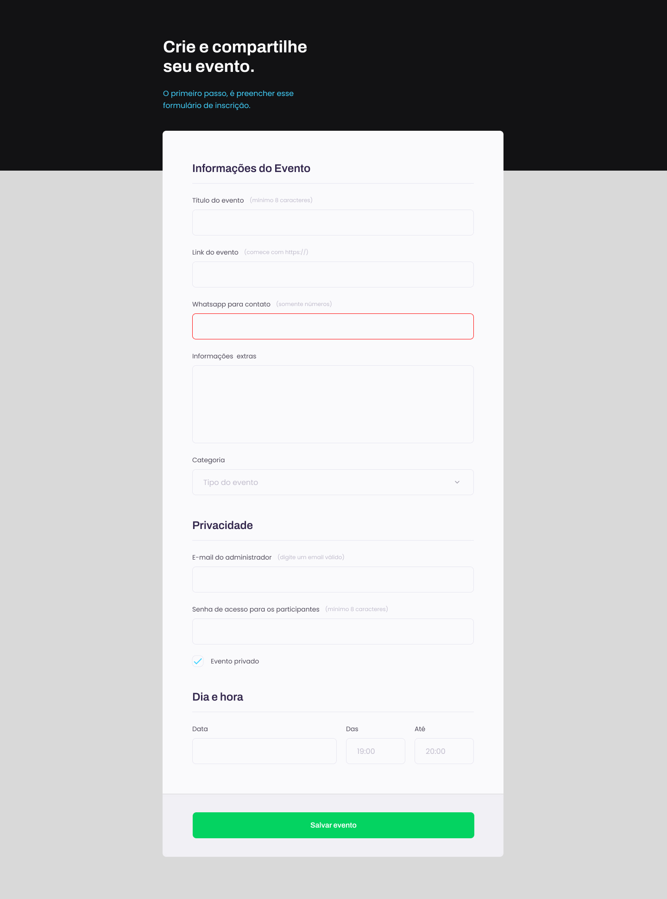

<h1 align="center"> Formulário </h1>

Projeto de um formulário, do curso Explorer, Stage3 da Rocketseat

  <a href="#-tecnologias">Tecnologias</a>&nbsp;&nbsp;&nbsp;|&nbsp;&nbsp;&nbsp;
  <a href="#-projeto">Projeto</a>&nbsp;&nbsp;&nbsp;|&nbsp;&nbsp;&nbsp;
  <a href="#-layout">Layout</a>&nbsp;&nbsp;&nbsp;|&nbsp;&nbsp;&nbsp;
  

 

  

## 🚀 Tecnologias

Esse projeto foi desenvolvido com as seguintes tecnologias:

- HTML e CSS
- JavaScript
- Git e Github

## 💻 Projeto

é um projeto que simula o formulário de preenchimento de dados para eventos.

## 🔖 Layout

Você pode visualizar o layout do projeto através [DESSE LINK](<https://www.figma.com/file/TOk1znrn0Q4MxP5pvQom7z/Explorer-Stage-03-Projeto-01-(Copy)?node-id=0%3A1&t=016TBQfQDulYiDmj-0>). É necessário ter conta no [Figma](https://figma.com) para acessá-lo.

---
